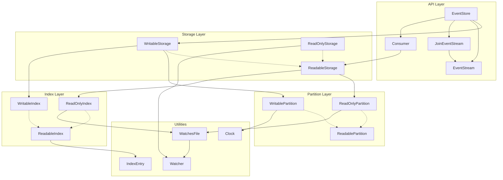

# Implementation Architecture

This page describes the technical implementation and architecture of the `node-event-storage` library — specifically the `/src` directory and its components, the relationships between them, and the key design decisions behind them.

---

## Source Directory Layout

| File / Directory | Lines | Role |
|------------------|------:|------|
| `EventStore.js` | ~614 | Public API facade — manages streams, commits, consumers, and concurrency |
| `EventStream.js` | ~275 | Iterable / Node.js Readable wrapper around a positional index |
| `JoinEventStream.js` | ~104 | Merges several `EventStream` instances into one globally-ordered stream |
| `Consumer.js` | ~302 | Durable event consumer with at-least-once / exactly-once delivery semantics |
| `Watcher.js` | ~149 | Reference-counting singleton that watches a directory for file-system changes |
| `WatchesFile.js` | ~55 | Mixin that wires a file to a `Watcher` instance and re-reads it on change |
| `Clock.js` | ~42 | Monotonic microsecond clock for per-event timestamps |
| `IndexEntry.js` | ~142 | Binary layout of one index record (partition, position, size, sequence number) |
| `util.js` | ~216 | Shared helpers: assertions, HMAC, matcher serialization, alignment maths |
| `Storage.js` | 4 | Facade — re-exports `WritableStorage` (default) and `ReadOnlyStorage` |
| `Partition.js` | 5 | Facade — re-exports `WritablePartition` (default) and `ReadOnlyPartition` |
| `Index.js` | 5 | Facade — re-exports `WritableIndex` (default) and `ReadOnlyIndex` |
| `Storage/WritableStorage.js` | ~534 | Append-only storage with write buffering and a global primary index |
| `Storage/ReadableStorage.js` | ~482 | Base class for read access: sequential scan, dirty reads, HMAC verification |
| `Storage/ReadOnlyStorage.js` | ~116 | Read-only storage that reacts to new files written by a sibling writer process |
| `Partition/WritablePartition.js` | ~362 | Append-only single-file partition with a write buffer and torn-write detection |
| `Partition/ReadablePartition.js` | ~430 | Buffered reading, document header/footer parsing, and metadata deserialization |
| `Partition/ReadOnlyPartition.js` | ~44 | Read-only partition that uses `WatchesFile` to detect appended data |
| `Index/WritableIndex.js` | ~239 | Builds and persists a binary position-list index; detects index/data divergence |
| `Index/ReadableIndex.js` | ~402 | Positional range lookups with binary search; loads and verifies stored matchers |
| `Index/ReadOnlyIndex.js` | ~48 | Read-only index variant that polls for appended entries via `WatchesFile` |

---

## Architecture Overview

The library is organized into four layers plus a set of shared utilities:

- **API Layer** — the public surface (`EventStore`, `EventStream`, `JoinEventStream`, `Consumer`).
- **Storage Layer** — coordinates multiple partitions and their indexes; enforces the single-writer lock.
- **Partition Layer** — wraps individual append-only data files; owns the write buffer.
- **Index Layer** — maintains lightweight per-stream byte-position lists; enables O(log n) range queries.
- **Utilities** — `Clock`, `IndexEntry`, `Watcher`, `WatchesFile`, and `util`.

Within each of the Storage, Partition, and Index layers there are three variants with a common inheritance chain:

```
Writable  ──extends──▶  Readable / Base
ReadOnly  ──extends──▶  Readable / Base
```

The diagram below shows the full dependency graph. **Solid arrows** (`──▶`) indicate a *uses / instantiates* relationship; **dashed arrows** (`- -▶`) indicate *extends / inherits*.

> **Note:** `util` is a shared helper module imported by almost every component and is omitted from the diagram for readability.



---

## Component Descriptions

### EventStore

`EventStore` is the top-level API class. It owns a `WritableStorage` (or `ReadOnlyStorage`) instance, creates `EventStream` objects on demand, and exposes the `commit()` method that writes one or more events atomically with optimistic-concurrency checking. It also manages `Consumer` lifecycles and fires `preCommit` / `preRead` hook events.

### EventStream

`EventStream` is a Node.js `Readable` (object mode) wrapped around a positional `ReadableIndex` range. It never reads ahead from the file; it only fetches documents when the consumer calls `read()` or when data is piped downstream. Supports `minRevision` / `maxRevision` bounds and reverse iteration.

### JoinEventStream

`JoinEventStream` merges several `EventStream` instances into a single globally-ordered stream by always yielding the event with the lowest sequence number across all inputs — a k-way merge. Used to build category streams and cross-aggregate projections.

### Consumer

`Consumer` is a durable, resumable event processor. It persists its current read position (and optionally a state snapshot) to disk after each successfully processed event. This gives at-least-once delivery semantics by default; calling `setState()` instead of advancing the position manually provides exactly-once semantics (position and state are written atomically). `Consumer` wraps a `ReadableStorage` and does not require a `WritableStorage`.

### Watcher / WatchesFile

`Watcher` is a reference-counting singleton around `fs.watch` for a directory. `WatchesFile` is a small mixin that connects an `Index` or `Partition` instance to a `Watcher`, allowing read-only components to detect when the underlying file has been extended by a writer in another process.

### Clock

`Clock` provides a monotonically increasing microsecond timestamp. It internally tracks the last returned value and increments it if the wall-clock has not advanced, ensuring a strict total order for up to 1 million events per second.

### Storage Layer

| Class | Purpose |
|-------|---------|
| `ReadableStorage` | Base class; scans existing partition files, opens `ReadOnlyIndex` / `ReadOnlyPartition` instances, provides `readFrom()` and index iteration. |
| `WritableStorage` | Extends `ReadableStorage`; adds a file-based lock, `WritablePartition`, `WritableIndex`, the global sequence counter, and `commit()`. |
| `ReadOnlyStorage` | Extends `ReadableStorage`; attaches a `Watcher` to the data and index directories so that events written by a sibling `WritableStorage` process are automatically discovered. |

### Partition Layer

| Class | Purpose |
|-------|---------|
| `ReadablePartition` | Buffered file reader; parses the binary document envelope (header + footer) and validates `commitId` / `commitSize` for torn-write detection. |
| `WritablePartition` | Extends `ReadablePartition`; manages the in-memory write buffer, stamps each event with a `Clock` value, and flushes to disk (optionally calling `fsync`). |
| `ReadOnlyPartition` | Extends `ReadablePartition`; uses `WatchesFile` to re-read the file when it grows, enabling live streaming in a separate process. |

### Index Layer

| Class | Purpose |
|-------|---------|
| `ReadableIndex` | Loads a binary position-list file into memory; provides O(log n) `find()` and O(1) range iteration; verifies persisted matcher HMACs. |
| `WritableIndex` | Extends `ReadableIndex`; appends new `IndexEntry` records on every commit and detects divergence between the index and its data partition on open. |
| `ReadOnlyIndex` | Extends `ReadableIndex`; uses `WatchesFile` to pick up entries appended by a remote writer and emits an `append` event for `ReadOnlyStorage`. |

---

## Technical Decisions

### Synchronous API

All write and read operations are synchronous. Node.js is single-threaded, and within a single thread synchronous I/O for small, sequential appends is significantly faster than going through the event-loop machinery required for async callbacks or Promises. Removing async boundaries also means the consistency model is simpler: a `commit()` call either succeeds or throws — there are no interleaved writes between awaited steps, and callers never need to reason about concurrent mutations of the same in-memory state.

### Append-Only Log as the Primary Storage Primitive

Traditional databases maintain a separate Write-Ahead Log to make their mutable storage crash-safe. Because node-event-storage never modifies existing data, the event file *is* the log. This eliminates WAL overhead entirely, reduces write amplification to a single sequential I/O path, and makes backups as simple as copying files. Natural MVCC isolation follows for free: a reader opened before a write always sees the same data because no records are ever overwritten.

### Write Buffering

Events are accumulated in an in-memory write buffer (16 KB default) before being flushed to disk. This converts many small `write()` syscalls into a single large one, dramatically improving throughput when committing high-frequency events. The buffer size and maximum document count are tunable; reducing them lowers the crash-loss window at the cost of I/O throughput.

### Single Writer Per Store

Each store directory is protected by a lock directory (`storeName.lock`) that only the active writer holds. This removes any need for distributed locks, CAS loops, or journal replay when two processes want to write simultaneously. Instead of silently serializing conflicting writes, the second process receives an immediate error, making contention explicit and allowing the caller to choose the appropriate recovery strategy (retry, fallback to a read-only view, etc.).

### Lightweight File-Position Indexes

Rather than B+-trees or LSM structures, each stream's index is a flat binary array of `IndexEntry` records (partition ID + byte offset + size). Lookups use binary search (O(log n)); sequential reads are O(1) pointer follows into the data file. Because the index has no pointers and no free-list management, it can be created cheaply per stream, rebuilt from scratch from the data file in a single linear pass, and memory-mapped without concern for fragmentation.

### Partition Per Stream

By default the `partitioner` function maps each stream name to its own file. This maximizes I/O locality — all events for a given aggregate are stored contiguously — and means that high-throughput streams do not compete for write-buffer space with low-throughput ones. Alternative partitioning strategies (hash buckets, time-based chunking) are supported through the `partitioner` option at the cost of the per-stream consistency boundary.

### JSON Serialization by Default

JSON is the default wire format because it is human-readable, requires no schema negotiation, and is debuggable with standard tools (`cat`, `jq`). It is deliberately pluggable: users who need smaller files or higher deserialization throughput can substitute MessagePack, Protobuf, or any `{ serialize, deserialize }` pair. The storage layer is completely agnostic to the payload format.

### Optimistic Concurrency Only

There is no built-in pessimistic locking or hidden retry mechanism. Callers pass an `expectedVersion` to `commit()`, and if the stream has advanced past that version the call throws `OptimisticConcurrencyError`. This is intentional: in a CQRS / event-sourcing context the caller already holds enough domain knowledge to decide whether to retry, reload state, or propagate a conflict error to the user. Hiding retries inside the store would make conflict rates invisible and would couple the retry policy to the persistence layer.

### Monotonic Clock for Global Ordering

Every event is stamped with a `Clock` value that increments in microseconds and never goes backwards even when the system clock is adjusted. This ensures a strict total order within a single writer session without requiring a distributed timestamp oracle or a central sequence-number service.

### Crash Recovery via Torn-Write Detection

When a process is killed mid-commit, the last write to a partition file may be incomplete. On the next open, `ReadablePartition` checks whether the `commitId` in the final document matches the expected `commitSize`. If not, the incomplete commit is truncated. Combined with `LOCK_RECLAIM`, `WritableStorage` also detects when the primary index lags behind the data file and automatically calls `reindex()` before emitting `'ready'`. This gives bounded, predictable recovery with no manual intervention required.

### Three-Tier Variant Design (Writable / Readable / ReadOnly)

Each layer (Storage, Partition, Index) ships three variants that share a common base class. This keeps the write-path code separate from the read-path code, allows read-only replicas to run in separate processes without pulling in the write-buffer machinery, and makes it straightforward to compose the right combination for a given deployment (single writer + multiple read-only projections, read-only Electron renderer process accessing a file written by the main process, etc.).
