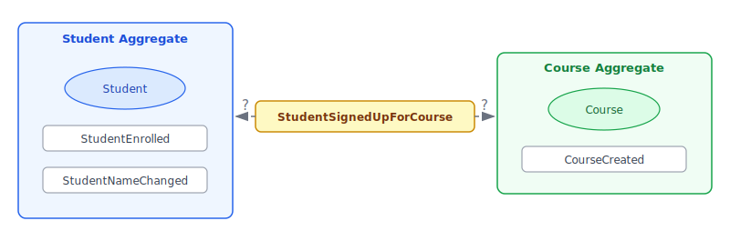
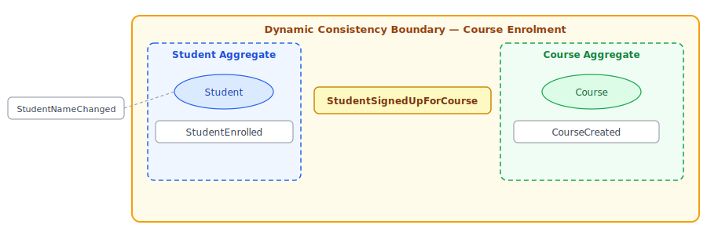

# Dynamic Consistency Boundaries (DCB)

## What is DCB?

**Dynamic Consistency Boundary** (DCB) is a pattern for event-sourced systems where the unit of consistency is defined at command-handling time rather than fixed to a single aggregate stream.

In traditional event-sourcing each command targets one aggregate (e.g. `order-42`) and optimistic concurrency is enforced by checking the aggregate stream's version.

DCB generalises this: the consistency boundary is expressed as a **query** over a set of event types (and an optional filter). Before reading, a **condition** captures the current global position in the event log. After building state from those events, the handler commits its new events together with the condition. The commit engine then checks whether any new matching events appeared — if so, a conflict is raised.

This removes the need to route every command through a fixed aggregate, enabling commands that naturally span multiple entities while retaining strong consistency guarantees.

Consider the classic example from Sara Pellegrini's talk: students subscribing to courses. The event `StudentSubscribedToCourse` concerns both a Student and a Course — in a traditional aggregate model it is unclear which aggregate owns it, and the Course aggregate keeps growing with every new event type:



DCB resolves this by letting each command handler declare exactly which events it needs to be consistent with. Different commands define different boundaries that can freely overlap:



---

## The DCB Workflow

### Step 1 — Query for the transaction context

```javascript
const { stream, condition } = store.query(
    ['OrderPlaced', 'OrderShipped'],                           // event types to watch
    (event, metadata) => event.orderId === 'order-42'          // optional filter
);
```

- `stream` — an `EventStream` filtered to events of the given types that also satisfy the optional matcher.
- `condition` — captures the current global event-log position; pass it to `commit()` to enforce the concurrency check.

The optional `matcher` narrows the boundary to exactly the events that would affect the decision — unrelated events of the same type (e.g. a different order) never cause spurious conflicts.

### Step 2 — Build the decision model

```javascript
const model = new OrderModel();
stream.forEach((event, metadata) => {
    model.apply(event);
});
```

### Step 3 — Commit with the condition

```javascript
try {
    store.commit('order-42', [{ type: 'OrderShipped', orderId: 'order-42', ... }], condition, () => {
        console.log('Committed successfully');
    });
} catch (e) {
    if (e instanceof EventStore.OptimisticConcurrencyError) {
        // A conflicting event appeared — replay and retry
    }
}
```

---

## Conflict Semantics

| Scenario | Result |
|----------|--------|
| No new events of any listed type appeared | ✅ No conflict |
| New events appeared, but none match the `matcher` | ✅ No conflict |
| New events appeared and at least one matches the `matcher` | ❌ `OptimisticConcurrencyError` |
| New events appeared and no `matcher` was provided | ❌ `OptimisticConcurrencyError` |

---

## Enabling DCB-style Queries with `typeAccessor`

`query()` requires a named stream per event type. Configure `typeAccessor` to have those streams created and maintained automatically on every `commit()`:

```javascript
const store = new EventStore('my-store', {
    storageDirectory: './data',
    typeAccessor: 'type'   // dot-notation path to the type field in the event payload
});
```

`typeAccessor` accepts a dot-notation path string (e.g. `'type'`, `'meta.kind'`) pointing to the event type field, which also enables faster index routing. For non-standard event layouts a function `(event) => string` can be used instead.

When configured, `query()` treats a missing type stream as empty rather than throwing — a type that has never been committed yet is simply an empty result.

> **Without `typeAccessor`**, `query()` throws if a listed type stream does not exist. You must create it first with `createEventStream()`, or use type-named entity streams (e.g. `commit('OrderPlaced', ...)`).

> **New stores only**: type indexes are built with `reindex=false` — they only cover events committed *after* the index was first created. Always configure `typeAccessor` from the beginning if you intend to use `query()`.

---

## Full Example

```javascript
import { EventStore } from 'event-storage';

const store = new EventStore('accounts', {
    storageDirectory: './data',
    typeAccessor: 'type'
});

store.on('ready', () => {

    function handleRegisterCustomer(command) {
        const { stream, condition } = store.query(
            ['CustomerRegistered'],
            (event) => event.email === command.email
        );

        let emailTaken = false;
        stream.forEach((event) => {
            if (event.email === command.email) emailTaken = true;
        });

        if (emailTaken) {
            throw new Error(`Email ${command.email} is already registered`);
        }

        store.commit(`customer-${command.customerId}`, [
            { type: 'CustomerRegistered', customerId: command.customerId, email: command.email }
        ], condition);
    }

    handleRegisterCustomer({ customerId: 'cust-1', email: 'alice@example.com' });
});
```

---

## The DCB Specification: Types and Tags

The formal DCB specification expresses a query as a list of **query items**, each pairing an array of event types with an array of **domain-identifier tags**:

```
queryItems = [
  { types: ['CourseCreated', 'CourseCapacityChanged', 'StudentSubscribedToCourse'],
    tags:  ['course:jdsj4'] },
  { types: ['StudentCreated', 'StudentSubscribedToCourse'],
    tags:  ['student:gfh3j'] }
]
```

An event matches when **any** item matches it: the event's type must be in that item's `types` **and** the event must carry **all** of that item's tags.

In node-event-storage this is expressed today using the `matcher` function. Pass the union of all types, and encode the per-item logic in the matcher:

```javascript
const courseId  = 'course:jdsj4';
const studentId = 'student:gfh3j';

const { stream, condition } = store.query(
    ['CourseCreated', 'CourseCapacityChanged', 'StudentCreated', 'StudentSubscribedToCourse'],
    (event, meta) =>
        (['CourseCreated', 'CourseCapacityChanged', 'StudentSubscribedToCourse'].includes(meta.stream)
            && meta.tags?.includes(courseId))
        ||
        (['StudentCreated', 'StudentSubscribedToCourse'].includes(meta.stream)
            && meta.tags?.includes(studentId))
);
```

The type membership check in the matcher duplicates what is already expressed in the `types` array — this is a current limitation. Future versions may introduce tag-based secondary indexes and a native query-item format to remove this duplication.

