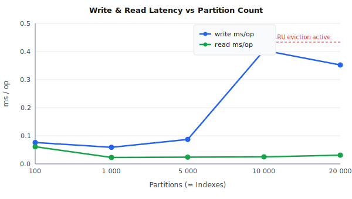
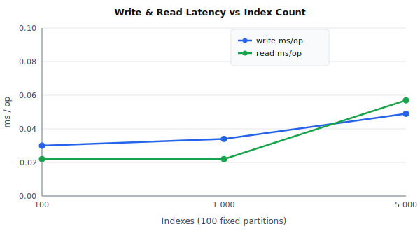

# Performance

This page documents the write, read, and startup performance of node-event-storage at scale and explains how to tune the two main parameters that control it.

Benchmarks were captured on Node.js v20 with the default configuration (`matcherProperties: ['stream', 'payload.type']`, `maxOpenPartitions: 1024`).  Each document is ~108 bytes.  Write samples are averaged over 100 consecutive `write()` calls with all secondary indexes registered.  Read samples are averaged over 100 reads spread evenly through the primary index.

---

## Scenario A — 1 index per partition (growing partitions)

Each partition holds 20 documents.  The number of secondary indexes equals the number of partitions.

| Partitions | Startup (ms) | Write (ms/op) | Read (ms/op) |
|------------|-------------:|---------------:|--------------:|
| 100        |          7.1 |          0.076 |         0.061 |
| 1 000      |         43.4 |          0.059 |         0.023 |
| 5 000      |        177.9 |          0.087 |         0.024 |
| 10 000     |        355.5 |          0.404 |         0.025 |
| 20 000     |        871.4 |          0.352 |         0.031 |



---

## Scenario B — 100 fixed partitions, growing index count

The partition count is fixed at 100.  The document set grows proportionally so each index receives at least 20 documents.

| Indexes | Startup (ms) | Write (ms/op) | Read (ms/op) |
|---------|-------------:|---------------:|--------------:|
| 100     |          2.9 |          0.030 |         0.022 |
| 1 000   |         22.1 |          0.034 |         0.022 |
| 5 000   |        246.2 |          0.049 |         0.057 |



---

## Analysis

### Write latency

Write latency is kept near-constant across both dimensions by the **discriminant lookup table** (see [Tuning: `matcherProperties`](#matcherproperties) below).  Instead of testing every registered matcher on every `write()` call (O(N) scan), the store does a two-level `Map` lookup on the document's discriminant property and only evaluates the one or two indexes that actually match.

The visible spike at 10 000 and 20 000 partitions in Scenario A (0.40–0.35 ms) is caused by **LRU partition-pool eviction**.  When the number of live partitions exceeds `maxOpenPartitions` (default 1 024) the store must close and reopen a file descriptor on every write that touches a cold partition.  Below that threshold write latency stays flat at ≤ 0.09 ms regardless of how many total indexes are registered.  See [Tuning: `maxOpenPartitions`](#maxopenpartitions) for guidance on eliminating this spike.

### Read latency

Read latency is dominated by the per-document partition seek and is largely flat in Scenario A because reads are served from the OS page cache after the first pass.  The jump at 5 000 indexes in Scenario B (0.057 ms) reflects the larger document set per partition (1 000 docs/partition vs. 20) rather than the index count itself.

### Startup time

Startup time scales linearly with the number of files on disk:

- The store performs one `readdir` call over the data directory followed by one `open` per partition.
- Registering secondary indexes (`openIndex` / `ensureIndex`) costs one `open` + header-read per index file.

For large deployments consider lazy-loading secondary indexes on first access rather than opening all of them during startup.

---

## Tuning

### `matcherProperties`

`matcherProperties` controls which document properties are used to build the fast O(1) discriminant table.  The default value `['stream', 'payload.type']` covers the standard `EventStore` workload where each stream maps to exactly one secondary index matched by a `{ stream: '<name>' }` object.

```js
// Default — optimises for stream-keyed indexes
new Storage('events', { matcherProperties: ['stream', 'payload.type'] });

// Override when your documents use a different discriminant field
new Storage('events', { matcherProperties: ['tenantId', 'eventType'] });

// Disable — falls back to an O(N) scan (pre-v1 behaviour)
new Storage('events', { matcherProperties: [] });
```

At index registration the store inspects the matcher object and stores the index name in a two-level Map keyed by the first `matcherProperties` entry whose value is a scalar in the matcher.  On `write()` the store extracts the same property from the incoming document and looks up only the matching index names — one Map lookup and one `matches()` call instead of N.

Function matchers and object matchers that do not contain any `matcherProperties` key are placed in an unclassified set and are always evaluated (they contribute an O(M) term where M is their count, independent of the total index count).

### `maxOpenPartitions`

`maxOpenPartitions` caps the number of simultaneously open partition file descriptors.  The default is **1 024**.  When a `write()` or `read()` needs a partition whose file descriptor has been evicted, the store closes the LRU entry and reopens the requested one.

| Scenario | Recommendation |
|----------|---------------|
| Partition count ≤ `maxOpenPartitions` | Default is fine; all partitions stay open and write latency is flat. |
| Partition count slightly above `maxOpenPartitions`, all partitions accessed frequently | Raise `maxOpenPartitions` to cover the full partition count, or set it to `0` to disable eviction entirely. |
| Very large partition count (tens of thousands), access is skewed to a working set | Leave the default; the LRU naturally keeps the hot partitions open. |
| Memory or fd budget is tight | Lower `maxOpenPartitions`. Each open partition costs one fd and the OS typically needs ~8 KB of kernel memory per open file. |

```js
// Raise the cap to avoid LRU eviction when all partitions are active
new Storage('events', {
    maxOpenPartitions: 4096
});

// Disable the cap entirely (pre-v1 behaviour — one fd per partition, forever)
new Storage('events', {
    maxOpenPartitions: 0
});
```

!!! note
    At 10 000 partitions with the default cap of 1 024, every write touches a different partition in the sample, so every write triggers a close+reopen.  Setting `maxOpenPartitions` to `0` (or ≥ 10 000) reduces write latency at that scale from ~0.40 ms back to ~0.09 ms.
